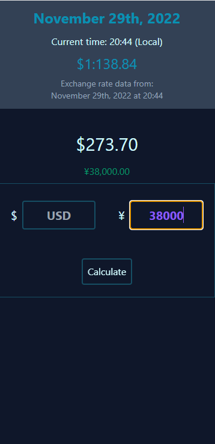

# JPY-Converter
  ## Description
  JPY Converter pulls exchange rate data from USD and JPY, and allows users to enter prices in either
  currency to compare the equivalent price in the matching pair.  Intended as a simple travel aid,
  JPY converter is not meant to be 100% accurate up to the second or less, and rather approximates the
  prices so travelers can get a rough estimate of the costs of goods and services.

  ## License
  

  ## Table of Contents
  1. [Installation](#Installation)
  2. [Deployment](#Deployment)
  3. [Usage](#Usage)
  4. [Screenshot](#Screenshot)
  5. [Contributing](#Contributing)
  6. [Technologies](#Technologies)
  7. [Tests](#Tests)
  8. [Questions](#Questions)

  ## Installation
  Although no installation is required to run this project, and it can be viewed from the GitHub
  pages deployment link, you can add the project to the home screen and use it like a native app.
  JPY Converter is a PWA, or Progressive Web App, which gives it this functionality.  If you would like
  to run the app without installing it, you can visit the Deployment section of the README for the link.

  ## Deployment
  https://lumberjon1.github.io/JPY-Converter/

  ## Usage
    Use while traveling to have a quick and handy way to check prices of items. The most recent exchange rate and timestamp are displayed at the top of the screen, and input fields allow users to enter numbers in either USD or JPY, then calculate the relative price in the other currency.

  ## Screenshot
  

  ## Contributing
  Please feel free to contact me if you have questions about contributing to this project.  You can reach out via my email or GitHub account linked below.

  ## Technologies
  * Tailwind CSS
  * Javascript
  * HTML
  * exchangerate.host API
  * PWA

  ## Tests
  No testing frameworks were used in the development of this project, and it does not contain test files.

  ## Questions
  [Check out my GitHub](https://github.com/LumberJon1)
  --or--
  Email me at JWilliams12117@gmail.com